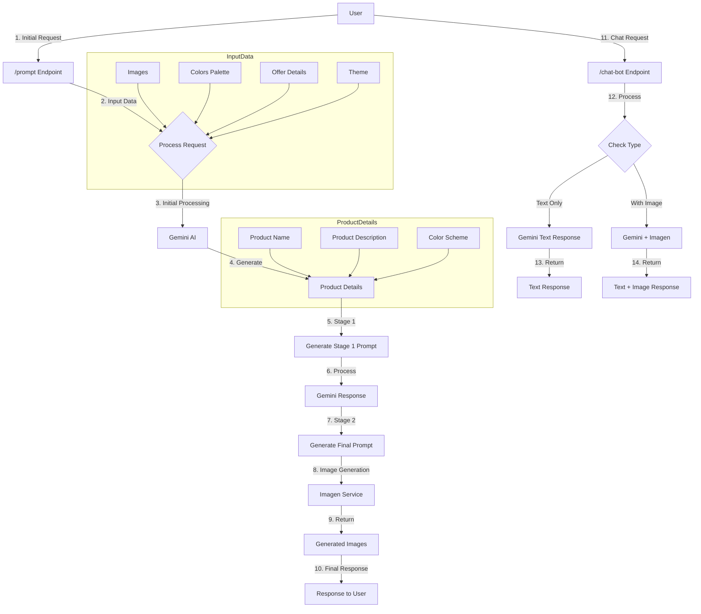
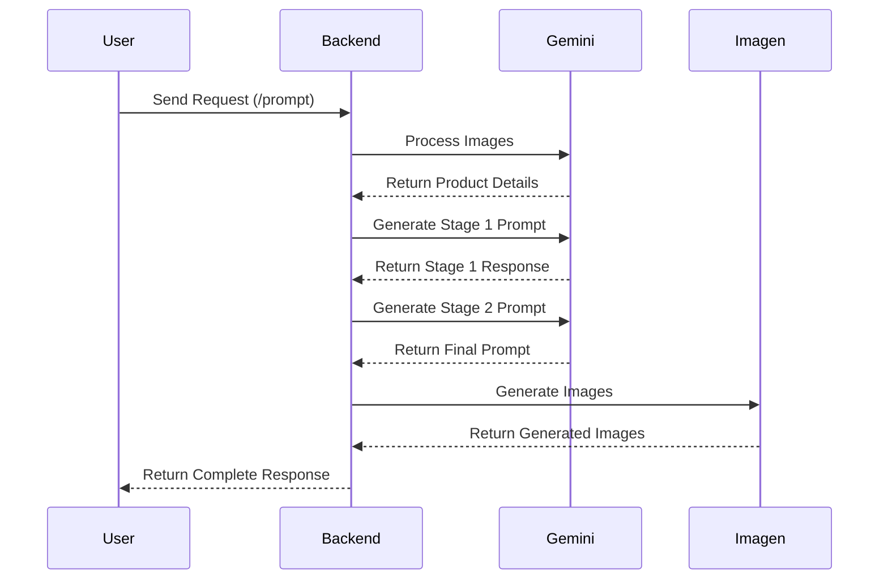
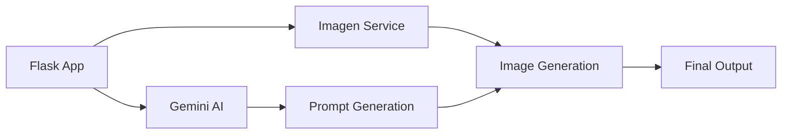
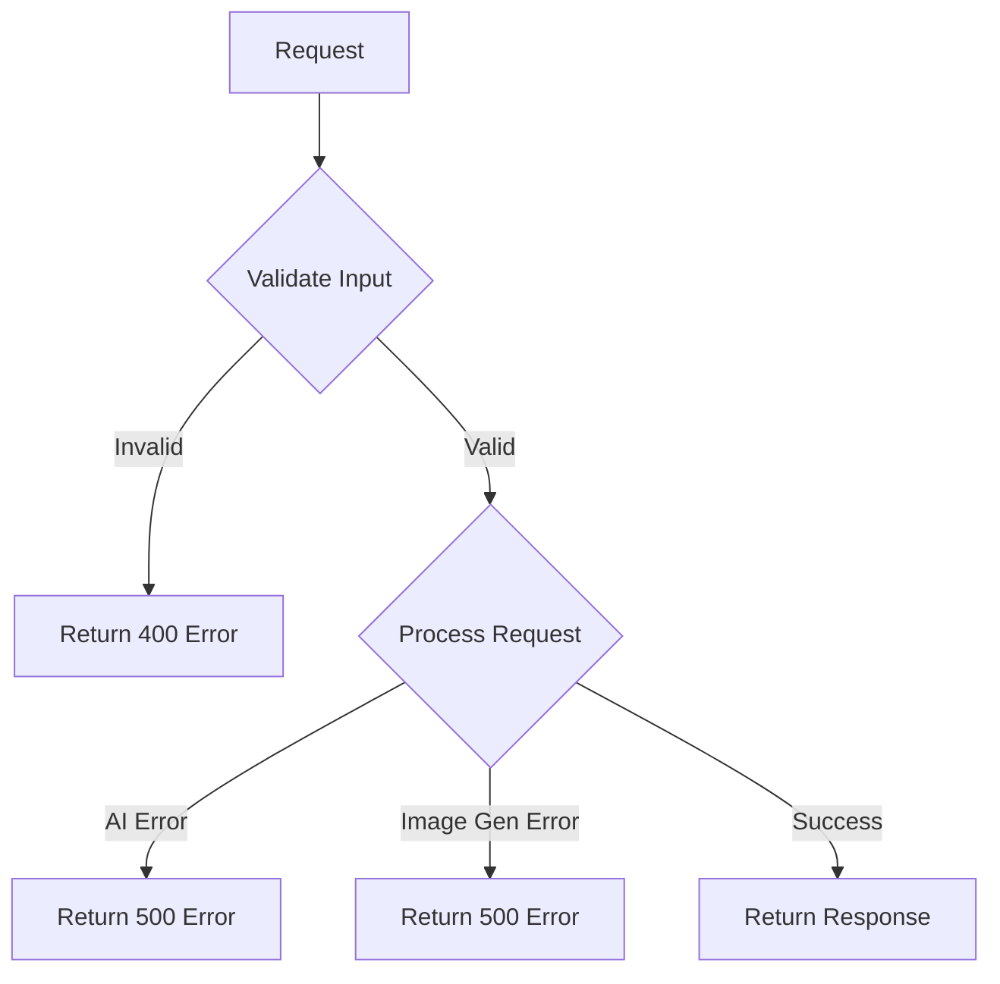

# System Flow Diagram

## User Journey and System Flow



## Detailed Flow Explanation

### 1. Initial Request Flow
1. **User Input**
   - Uploads product images
   - Provides color palette
   - Specifies offer details
   - Selects theme

2. **Data Processing**
   - System validates input
   - Processes images
   - Prepares data for AI processing

### 2. AI Processing Flow
1. **Initial Analysis**
   - Gemini AI analyzes images
   - Generates product details
   - Creates initial prompts

2. **Two-Stage Prompt Generation**
   - Stage 1: Basic product description
   - Stage 2: Detailed marketing content

### 3. Image Generation Flow
1. **Final Prompt Creation**
   - Combines all parameters
   - Optimizes for image generation

2. **Image Generation**
   - Imagen service creates images
   - System processes and validates output

### 4. Chatbot Flow
1. **User Interaction**
   - Text-based queries
   - Image generation requests

2. **Response Generation**
   - Text-only responses
   - Combined text and image responses

## Data Flow



## File Structure

```
backend/
├── app.py                 # Main application file
├── requirements.txt       # Dependencies
├── .env                  # Environment variables
├── src/
│   ├── flow_after_imagegen.py  # Post-generation flow
│   ├── gemini_utils.py         # Gemini AI integration
│   ├── imagen.py              # Image generation
│   └── prompts.py             # Prompt templates
├── semantic_search.py    # Search functionality
└── gemini_file.py       # Additional Gemini utilities
```

## Key Components Interaction



## Error Handling Flow

