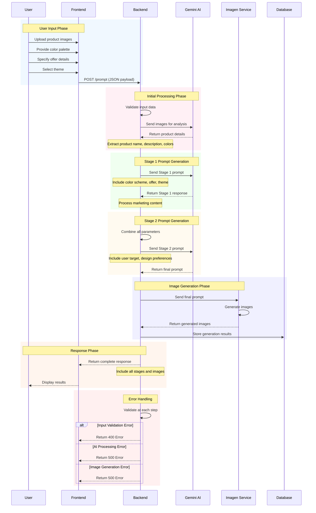
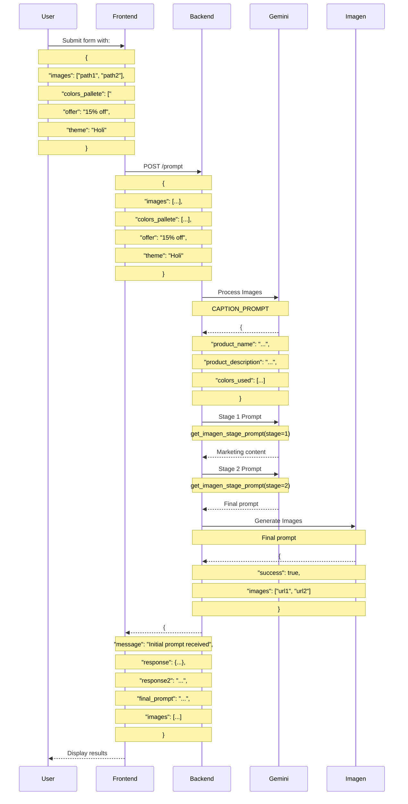
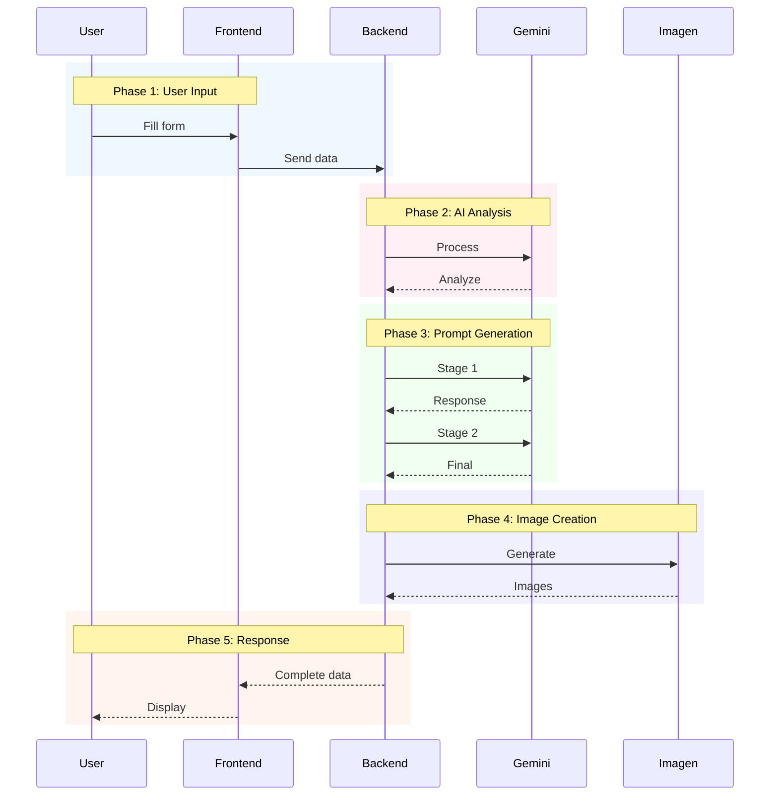

# Detailed Sequence Diagram for /prompt Route

## Complete Flow Sequence

```mermaid
sequenceDiagram
    %% Define participants with colors
    participant User as User
    participant Frontend as Frontend
    participant Backend as Backend
    participant Gemini as Gemini AI
    participant Imagen as Imagen Service
    participant DB as Database

    %% Style definitions
    rect rgb(240, 248, 255)
        Note over User,Frontend: User Input Phase
        User->>Frontend: Upload product images
        User->>Frontend: Provide color palette
        User->>Frontend: Specify offer details
        User->>Frontend: Select theme
        Frontend->>Backend: POST /prompt (JSON payload)
    end

    rect rgb(255, 240, 245)
        Note over Backend,Gemini: Initial Processing Phase
        Backend->>Backend: Validate input data
        Backend->>Gemini: Send images for analysis
        Gemini-->>Backend: Return product details
        Note over Backend: Extract product name, description, colors
    end

    rect rgb(240, 255, 240)
        Note over Backend,Gemini: Stage 1 Prompt Generation
        Backend->>Gemini: Send Stage 1 prompt
        Note over Backend: Include color scheme, offer, theme
        Gemini-->>Backend: Return Stage 1 response
        Note over Backend: Process marketing content
    end

    rect rgb(255, 250, 240)
        Note over Backend,Gemini: Stage 2 Prompt Generation
        Backend->>Backend: Combine all parameters
        Backend->>Gemini: Send Stage 2 prompt
        Note over Backend: Include user target, design preferences
        Gemini-->>Backend: Return final prompt
    end

    rect rgb(240, 240, 255)
        Note over Backend,Imagen: Image Generation Phase
        Backend->>Imagen: Send final prompt
        Imagen->>Imagen: Generate images
        Imagen-->>Backend: Return generated images
        Backend->>DB: Store generation results
    end

    rect rgb(255, 245, 238)
        Note over Backend,User: Response Phase
        Backend-->>Frontend: Return complete response
        Note over Backend: Include all stages and images
        Frontend-->>User: Display results
    end

    %% Error handling
    rect rgb(255, 240, 240)
        Note over Backend: Error Handling
        Backend->>Backend: Validate at each step
        alt Input Validation Error
            Backend-->>Frontend: Return 400 Error
        else AI Processing Error
            Backend-->>Frontend: Return 500 Error
        else Image Generation Error
            Backend-->>Frontend: Return 500 Error
        end
    end
```

## Detailed Data Flow

```mermaid
sequenceDiagram
    participant User
    participant Frontend
    participant Backend
    participant Gemini
    participant Imagen

    %% Initial Request
    User->>Frontend: Submit form with:
    Note over User,Frontend: {
    Note over User,Frontend:   "images": ["path1", "path2"],
    Note over User,Frontend:   "colors_pallete": ["#FF0000", "#00FF00"],
    Note over User,Frontend:   "offer": "15% off",
    Note over User,Frontend:   "theme": "Holi"
    Note over User,Frontend: }

    Frontend->>Backend: POST /prompt
    Note over Frontend,Backend: {
    Note over Frontend,Backend:   "images": [...],
    Note over Frontend,Backend:   "colors_pallete": [...],
    Note over Frontend,Backend:   "offer": "15% off",
    Note over Frontend,Backend:   "theme": "Holi"
    Note over Frontend,Backend: }

    %% Initial Processing
    Backend->>Gemini: Process Images
    Note over Backend,Gemini: CAPTION_PROMPT
    Gemini-->>Backend: {
    Note over Gemini,Backend:   "product_name": "...",
    Note over Gemini,Backend:   "product_description": "...",
    Note over Gemini,Backend:   "colors_used": [...]
    Note over Gemini,Backend: }

    %% Stage 1
    Backend->>Gemini: Stage 1 Prompt
    Note over Backend,Gemini: get_imagen_stage_prompt(stage=1)
    Gemini-->>Backend: Marketing content

    %% Stage 2
    Backend->>Gemini: Stage 2 Prompt
    Note over Backend,Gemini: get_imagen_stage_prompt(stage=2)
    Gemini-->>Backend: Final prompt

    %% Image Generation
    Backend->>Imagen: Generate Images
    Note over Backend,Imagen: Final prompt
    Imagen-->>Backend: {
    Note over Imagen,Backend:   "success": true,
    Note over Imagen,Backend:   "images": ["url1", "url2"]
    Note over Imagen,Backend: }

    %% Final Response
    Backend-->>Frontend: {
    Note over Backend,Frontend:   "message": "Initial prompt received",
    Note over Backend,Frontend:   "response": {...},
    Note over Backend,Frontend:   "response2": "...",
    Note over Backend,Frontend:   "final_prompt": "...",
    Note over Backend,Frontend:   "images": [...]
    Note over Backend,Frontend: }

    Frontend-->>User: Display results
```

## Component Interaction Timeline

```mermaid
sequenceDiagram
    participant User
    participant Frontend
    participant Backend
    participant Gemini
    participant Imagen

    rect rgb(240, 248, 255)
        Note over User,Frontend: Phase 1: User Input
        User->>Frontend: Fill form
        Frontend->>Backend: Send data
    end

    rect rgb(255, 240, 245)
        Note over Backend,Gemini: Phase 2: AI Analysis
        Backend->>Gemini: Process
        Gemini-->>Backend: Analyze
    end

    rect rgb(240, 255, 240)
        Note over Backend,Gemini: Phase 3: Prompt Generation
        Backend->>Gemini: Stage 1
        Gemini-->>Backend: Response
        Backend->>Gemini: Stage 2
        Gemini-->>Backend: Final
    end

    rect rgb(240, 240, 255)
        Note over Backend,Imagen: Phase 4: Image Creation
        Backend->>Imagen: Generate
        Imagen-->>Backend: Images
    end

    rect rgb(255, 245, 238)
        Note over Backend,User: Phase 5: Response
        Backend-->>Frontend: Complete data
        Frontend-->>User: Display
    end
``` 